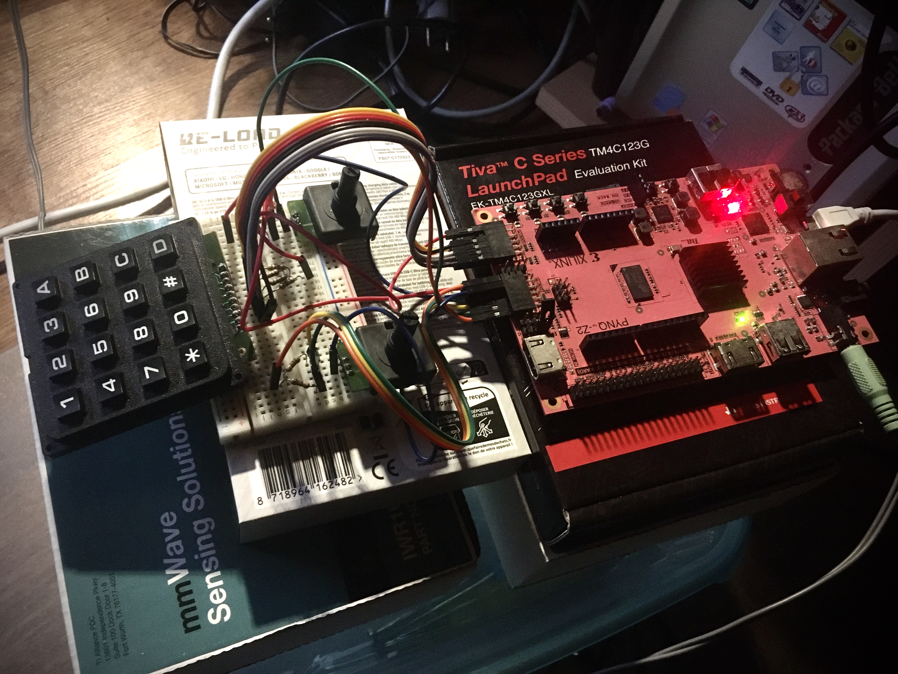

# Audio Synthesizer

This project contains an audio synthesizer implemented on a PYNQ-Z developer board.

## Basic audio controls
- Volume control
- Left/Right panning

## Audio effects
- Delay
- Echo
- Reverb
- Distortion/overdrive
- flanger

## Hardware
- PYNQ-Z2 developer board
- Linear encoder x2
- Keypad 4X4

## Youtube demonstration
https://youtu.be/CC5gwtUlaAE